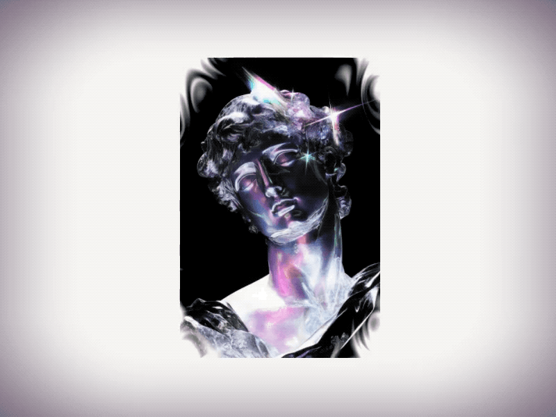

# Shader based Reveal Effect with React Three Fiber

_A simple yet pretty cool image reveal effect made with React-Three-Fiber/Drei and animated with FramerMotion._



[Article on Codrops](https://tympanus.net/codrops/?p=83030)

[Demo](https://tympanus.net/Tutorials/R3FImageReveal/)

## Installation

```bash
npm install
```

## Build and Run

```bash
npm run dev
```

or

```bash
npm run build
```

## Credits

- Image generated with [Midjourney](https://www.midjourney.com/)

## Misc

Follow Colin: [X](http://www.x.com/colindmg), [Linkedin](https://www.linkedin.com/in/colindmg/), [GitHub](https://github.com/colindmg)

Follow Codrops: [Bluesky](https://bsky.app/profile/codrops.bsky.social), [Facebook](http://www.facebook.com/codrops), [GitHub](https://github.com/codrops), [Instagram](https://www.instagram.com/codropsss/), [X](http://www.x.com/codrops)

## License

[MIT](LICENSE)

Made with :blue_heart: by [Colin](http://www.x.com/colindmg) & [Codrops](http://www.codrops.com)
